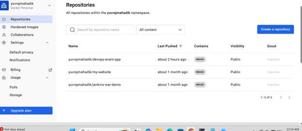
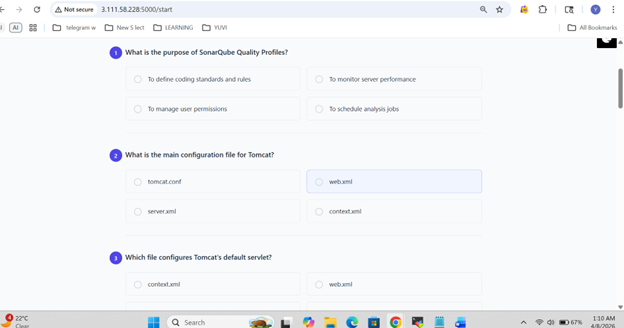
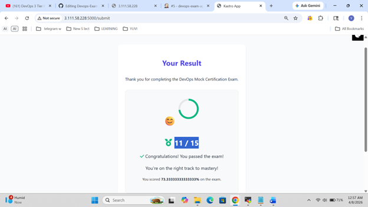
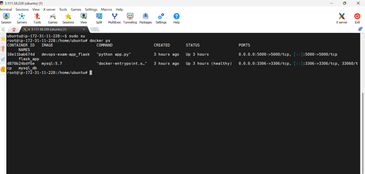
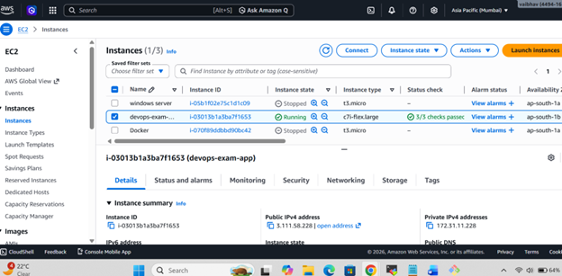

DevOps Exam Application 🚀
📌 **Project Overview**
This project demonstrates a complete DevOps CI/CD pipeline for a 3-tier web application.
The application allows users to attempt a mock exam and stores results in a MySQL database.

🏗️ **Architecture**
Frontend (HTML) → Backend (Python Flask) → Database (MySQL)

⚙️ **Tools Used**
Tool	                      Purpose
Jenkins      	          CI/CD Pipeline
Docker	                Containerization
Docker Compose	        Multi-container deployment
Trivy	                  Security scanning
Docker Scout	          Image vulnerability scan
AWS EC2	                Cloud hosting

**CI/CD Pipeline Stages**
1.	Git Checkout
2.	Trivy File System Scan
3.	Docker Build
4.	Docker Push to DockerHub
5.	Docker Scout Scan
6.	Deployment using Docker Compose
7.	Verification

 **SonarQube Note**
SonarQube integration was initially configured for code quality analysis.
However, due to limited EC2 resources, it was disabled to ensure smooth pipeline execution.

**Screenshots:**
### Jenkins Pipeline

### Application Homepage

### DockerHub Image

### Exam Questions

### Exam Result

### Docker Containers Running

### EC2 Instance

